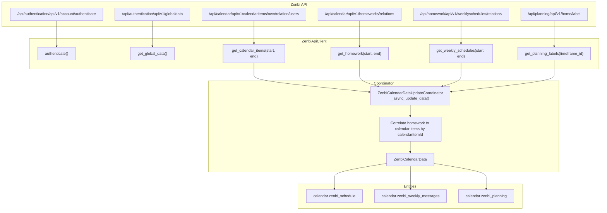

# PLANNING.md: Zenbi Home Assistant Integration Baseline & Roadmap

This document serves as the retroactive architectural baseline, test coverage audit, debt register, and forward roadmap for the **Zenbi Home Assistant Integration** (`custom_components/zenbi`).

---

## 1. Current State & Architecture

The integration connects Home Assistant to the Danish school communication platform Zenbi (`https://app.zenbi.dk`). It is engineered to Home Assistant Core standards with asynchronous I/O, HACS packaging compatibility, and localization.

### 1.1 Directory Structure
```text
custom_components/zenbi/
├── __init__.py           # Lifecycle hooks: setup, unload, reload listeners
├── manifest.json         # Component metadata, version 1.0.0, cloud_polling
├── const.py              # Constants, endpoints, default intervals, User-Agent
├── coordinator.py        # DataUpdateCoordinator (14-day rolling window, asyncio.gather)
├── calendar.py           # CalendarEntity platform (Schedule, Planning, WeeklyMessages)
├── config_flow.py        # UI config flow & reauth modal
├── options_flow.py       # UI options flow (configurable polling intervals)
├── diagnostics.py        # Credential redaction and diagnostics exporter
├── strings.json          # Translation template strings
├── translations/
│   ├── da.json           # Danish localization (Skema, Årsplan, Ugebreve)
│   └── en.json           # English localization
└── api/
    ├── __init__.py       # Package exports
    ├── client.py         # Async HTTP client (JWT auto-refresh, stable device ID)
    ├── exceptions.py     # Custom exception hierarchy
    └── models.py         # Strongly-typed dataclasses & Quill Delta to Markdown parser

scripts/
└── test_live.py          # Standalone CLI diagnostic tool with session token caching

tests/
├── conftest.py           # Lightweight Home Assistant shims & mock fixtures
├── test_api_client.py    # Unit tests for client, models, and parser
└── test_integration.py   # Integration tests for coordinator, entities, and flows
```

### 1.2 Implemented Components

#### Calendar Entities (`calendar.py`)
- **`ZenbiScheduleCalendarEntity` (`calendar.zenbi_schedule` / "Skema")**:
  - Timed lesson entries with subject title, start/end timestamps, and classroom resources.
  - Automatically correlates and appends related **homework** tasks.
  - Exposes metadata (`substitutes`, `note`, `planning_icon`, `planning_color`, `homework` array) in `extra_state_attributes`.
  - Implements `entity_registry_enabled_default`: automatically enabled if classes exist in the current window.
- **`ZenbiPlanningCalendarEntity` (`calendar.zenbi_planning` / "Årsplan")**:
  - All-day calendar events for school-wide milestones, holidays, and semester themes.
  - Implements exclusive date conversion (`start` to `end + 1 day`) compliant with Home Assistant calendar standards.
  - Implements `entity_registry_enabled_default`: defaults to **disabled** when the school does not publish planning labels (`[]`), avoiding dashboard clutter while remaining user-toggleable.
- **`ZenbiWeeklyMessagesCalendarEntity` (`calendar.zenbi_weekly_messages` / "Ugebreve")**:
  - 7-day all-day events representing weekly class newsletters and schedules ("Ugeplaner").
  - Derives summary title from first text line or attachment name.
  - Formats rich text descriptions and lists attachment file names.
  - Implements `entity_registry_enabled_default`: enabled if weekly messages exist.

#### Data Coordinator (`coordinator.py`)
- **Rolling Window**: Computes a rolling 14-day window (Monday 00:00:00 to Monday 00:00:00 14 days later) strictly in `Europe/Copenhagen` time.
- **Concurrent Polling**: Executes `asyncio.gather(..., return_exceptions=True)` across all four endpoints (`calendaritems`, `homeworks`, `weeklyschedules`, `labels`).
- **Resilience & Fault Isolation**: Failures in secondary endpoints (`planning_labels`, `weekly_schedules`, `homeworks`) log warnings and fall back to empty collections without interrupting core timetable updates.
- **On-Demand Queries**: `async_get_calendar_items()` and `async_get_weekly_schedules()` check in-memory cache first; if requested range exceeds the 14-day window, queries the API on-demand.
- **Zero Memory Leaks**: State payload (`ZenbiCalendarData`) is cleanly replaced on each coordinator cycle; no unbounded historical collections.

#### Config & Options Flows (`config_flow.py`, `options_flow.py`)
- **Initial Setup**: Accepts username, password, and optional `unique_device_id`.
- **Anti-Spam Login ID**: If device ID is omitted, computes a deterministic UUID (`uuid.uuid5(uuid.NAMESPACE_DNS, f"zenbi-device-{username.lower()}")`), eliminating "new browser login" security alert emails from Zenbi.
- **Re-Authentication Flow**: Native `async_step_reauth` and `async_step_reauth_confirm` dialogs allow updating passwords directly without re-adding the integration.
- **Options Flow**: Configurable `calendar_sync_interval_hours` (default 24h) and `notification_sync_interval_mins` (default 15m).

#### API Client Layer (`api/client.py`, `api/models.py`)
- **Authentication**: Authenticates with two-factor null GUID (`00000000-0000-0000-0000-000000000000`) and device ID.
- **Session Pooling**: Injects and respects Home Assistant's shared `aiohttp.ClientSession` (`async_get_clientsession(hass)`).
- **JWT Expiry Management**: Parses unverified token payload `exp` timestamp to proactively detect expiry, and automatically retries requests on HTTP 401.
- **Browser User-Agent**: Transmits standard Chrome desktop `User-Agent` headers.
- **Quill Delta Parser**: Translates Zenbi's internal JSON AST into clean GitHub/HA Markdown, supporting bold, italics, headers, links, bullet lists (`- `), ordered lists (`1. `), HTML entities, and Danish characters (`æ`, `ø`, `å`, `Æ`, `Ø`, `Å`).

---

## 2. Verified Coverage vs. Untested Paths

### 2.1 Verified Coverage (36 Passing Automated Tests)
Automated tests in `tests/` execute via `pytest` without requiring a full Home Assistant installation, using lightweight shims in `tests/conftest.py`.

| Area | Verified Behaviors |
| :--- | :--- |
| **JWT & Auth** | Token `exp` decoding, successful auth payload parsing, invalid credentials (401), server errors (500), missing token in auth response, network failures, request auto-retry on 401, session ownership (`close()` for owned vs. injected sessions). |
| **API Endpoints** | Fetching calendar items (list & wrapped dict payloads), empty response handling, planning labels, homework, weekly schedules, on-demand query fallback outside 14-day window, notification stub (`[]`). |
| **Parser & Models** | Quill Delta formatting (bold, italic, headers, bullets, ordered lists, links), HTML unescape, Danish Unicode preservation (`æ`, `ø`, `å`, `Æ`, `Ø`, `Å`). |
| **Device ID** | Stable deterministic UUID generation (`uuid.uuid5`), case-insensitive username normalization. |
| **Coordinator** | Successful data aggregation, rolling 14-day window date math (both tz-aware and tz-naive inputs), on-demand caching vs. API queries, concurrent partial error isolation (`asyncio.gather`). |
| **Calendar Entities** | Timed event conversion, all-day event boundary conversion (+1 day), 7-day weekly schedule conversion, extra state attributes, `entity_registry_enabled_default` logic when empty vs. populated, graceful handling of malformed datetime/content payloads. |
| **Flows & Lifecycle** | Config flow setup, invalid credentials handling, options flow update, entry setup (`async_setup_entry`), entry unload (`async_unload_entry`), reauth flow password update, reload, and connection error resilience. |
| **Diagnostics** | Diagnostic dictionary structure, credential redaction (`password`, `unique_device_id`, tokens), runtime data integration. |

### 2.2 Untested Code Paths & Future Targets
1. **API Client**:
   - `get_notifications()`: Pending discovery of real notification endpoints in Phase 5.
2. **Options Flow**:
   - Boundary validation for user-submitted sync intervals (schema enforces `min=1`).
3. **Multi-Student Accounts**:
   - Real-world multi-child relation payloads from `/calendaritems/own/relation/users`.

---

## 3. API & Data Flow Audit

### 3.1 Endpoint Mapping



### 3.2 Key Data Transformations
- **Date Formatting**: `format_zenbi_datetime(dt)` transforms local or UTC timestamps to Copenhagen time with 3-digit millisecond precision (`2026-09-14T00:00:00.000+02:00`), required by Zenbi's ASP.NET backend.
- **Quill Delta Parsing**: Rich text payloads in format `{"ops": [{"insert": "..."}, ...]}` pass through `parse_quill_delta()` to convert linebreaks, block attributes (`list: bullet`, `list: ordered`), headers, and inline styles into standard Markdown.
- **Homework Correlation**: Homework items from `/homeworks/relations` carry `calendarItemId`. The coordinator maps them into a dictionary by `calendarItemId` and attaches matching assignments to `ZenbiCalendarItem.homework`.
- **All-Day Event Boundary**: All-day planning and weekly schedule events convert inclusive API dates to exclusive Home Assistant end dates (`end_date = start_date + 1 day` or `+ 7 days`).

---

## 4. Known Debt & Fragile Areas

### 4.1 Architectural & Deprecation Considerations
- **`entry.runtime_data` vs. `hass.data[DOMAIN]`**:
  - In Home Assistant 2024.x+, storing coordinator references on `entry.runtime_data` is preferred. Currently, both `hass.data[DOMAIN][entry.entry_id]` and `entry.runtime_data` are assigned in `__init__.py`, but `diagnostics.py` and `calendar.py` still read from `hass.data[DOMAIN]`.
- **Timezone Fallback**:
  - If Python's `zoneinfo` cannot load `Europe/Copenhagen` (e.g. stripped minimal Linux containers without `tzdata`), `get_copenhagen_tz()` falls back to system local timezone or UTC. While `tzdata` is listed in project requirements, environments lacking tzdata could experience UTC offset filtering discrepancies.

### 4.2 API Quirks & Edge Cases
- **Multi-Student / Multi-Child Ambiguity**:
  - Current API queries use `/calendaritems/own/relation/users`. For parents with multiple children enrolled in Zenbi, all children's classes may return in a single unified stream. The API includes `participantModels` and participant IDs, but the integration currently merges all items into one schedule calendar without per-child filtering or entity splitting.
- **Attachment URLs**:
  - Attachments in homework and weekly schedules only display file names (`name` / `title`). Resolving download links requires authenticating against Zenbi's file download endpoints and generating temporary download tokens.
- **Timeframe ID Resolution**:
  - The planning labels endpoint requires a `timeframeId`. If `get_global_data()` fails or returns no active timeframe ID, planning labels cannot be queried.

---

## 5. Backlog & Next Phases

### Phase 2: Test Suite Expansion & Hardening (Completed)
- [x] **Branch Coverage**: Added tests for untested branches (`async_get_weekly_schedules` on-demand out of window, corrupted payload exception handling in entities, missing token error, connection error in reauth).
- [x] **Runtime Data Modernization**: Migrated `calendar.py` and `diagnostics.py` to use `entry.runtime_data` with backward-compatible fallback.
- [x] **Naive Datetime Verification**: Added automated test verifying Copenhagen timezone attachment when naive datetimes are passed.
- [x] **Session Ownership & Stub Verification**: Added tests for `close()` behavior on owned vs. external sessions and `get_notifications()` placeholder.

### Phase 3: Multi-Student Support & Filtering
- [ ] **Audit Multi-Child Payloads**: Inspect `/own/relation/users` and `participantModels` with multi-student parent accounts.
- [ ] **Per-Child Calendar Entities**: Support generating distinct `calendar.zenbi_schedule_<child>` entities or configurable student selection in Options Flow.

### Phase 4: Absence Reporting & Service Calls
- [ ] **Reverse-Engineer Absence Endpoints**: Trace Zenbi web app endpoints for student absence registration ("Meld fravær / sygdom").
- [ ] **Home Assistant Service Integration**: Implement `zenbi.report_absence` service call with date range and reason parameters.

### Phase 5: Notification Platform & Unread Messages
- [ ] **Notifications Endpoint**: Implement real API calls for `/api/notification/...` replacing the placeholder in `client.py`.
- [ ] **Sensor Platform**: Add sensor entity (`sensor.zenbi_unread_messages` / `sensor.zenbi_notifications`) tracking unread school notices.
- [ ] **Attachment Download Links**: Investigate signed temporary URLs for homework attachments.

